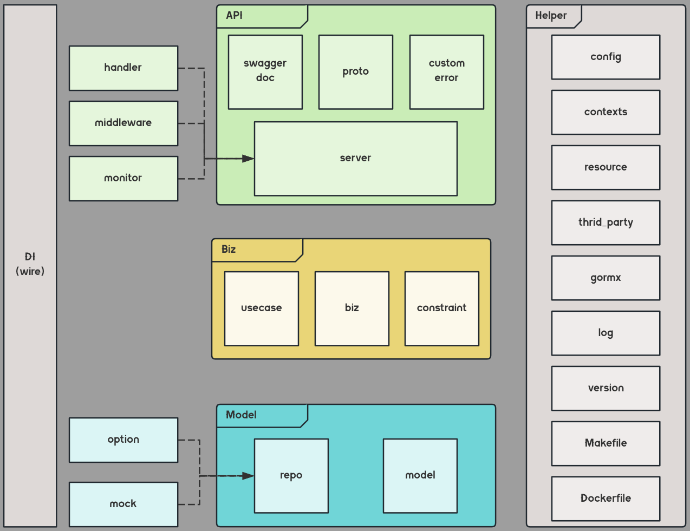

<div align="center"></div>

# meta-egg
Awesome Tools to Generate MetaEgg Framework, which is a Concise Framework For Golang.

# User Guide
https://meta-egg.jinglever.com/

# Example
A Repositry Generated by meta-egg
https://github.com/Jinglever/meta-egg-layout

# Installation
Download the latest binary from https://github.com/Jinglever/meta-egg/releases,
and put it in your $PATH.

# Framework Structure


# Directory Structure
```bash
.
├── api  --------------------------  由protoc根据proto生成的api代码
├── build
│   ├── bin
│   └── package  ------------------  Dockerfile之类跟打包有关的文件
├── cmd  --------------------------  工程启动的入口
├── configs  ----------------------  配置文件（如：conf.yml）
├── docs  -------------------------  工程文档（如：swagger doc）
├── gen
│   ├── model  --------------------  由meta-egg生成的数据模型定义
│   └── repo  ---------------------  由meta-egg生成的数据模型基础读写接口
├── go.mod
├── go.sum
├── internal
│   ├── biz  ----------------------  业务逻辑（通常是单实体的内在逻辑）
│   ├── common
│   │   ├── cerror  ---------------  自定义错误
│   │   ├── constraint  -----------  业务约束（业务相关的常量或配置项等）
│   │   ├── contexts  -------------  上下文管理（如session、logger等）
│   │   └── resource  -------------  全局资源（如：db，外部服务客户端等）
│   ├── config  -------------------  配置管理
│   ├── handler
│   │   ├── grpc  -----------------  GRPC服务的处理接口
│   │   └── http  -----------------  HTTP服务的处理接口
│   ├── repo  ---------------------  自定义的数据模型读写接口
│   │   ├── mock  -----------------  由mockgen生成的mock桩
│   │   └── option  ---------------  自定义的数据结构（如FilterOption等）
│   ├── server
│   │   ├── grpc  -----------------  GRPC服务监听及中间件
│   │   ├── http  -----------------  HTTP服务监听及中间件
│   │   └── monitor  --------------  pprof监控服务
│   └── usecase  ------------------  业务逻辑（通常是跨实体的业务块）
├── LICENSE
├── Makefile
├── _manifest  --------------------  meta-egg工作区（包含原始数据模型定义）
│   ├── generated  ----------------  生成的原始文件（同于new命令的生成结果）
│   └── sql  ----------------------  db命令生成的全量、增量sql，及元数据sql
├── pkg  --------------------------  组件包
├── proto  ------------------------  Protobuf定义（包含自定义错误）
├── README.md
├── sql  --------------------------  工程的sql文件
└── third_party  ------------------  第三方服务包
```